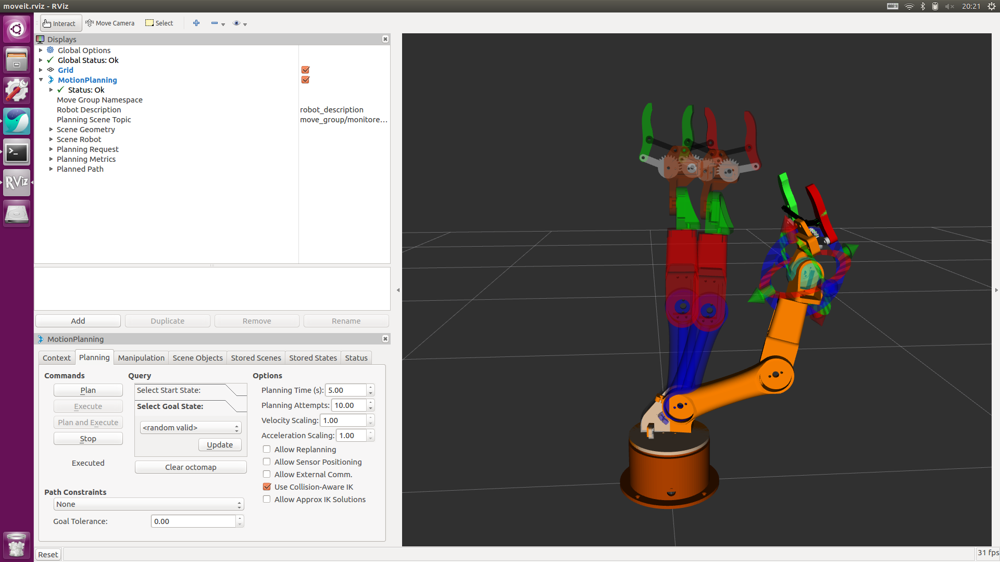

# ros_manipulator_moveit

## ros_manipulator_project의 moveit 버전

### Run project
~~~
$ roslaunch ros_manipulator_moveit demo.launch
~~~

### moveit 수정하기
~~~
$ roslaunch ros_manipulator_moveit setup_assistant.launch
~~~
